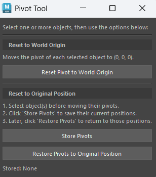

# FINAL -- Pivot Tool 
----------------------------------------------

# Tech Stack
|Tool  |Version|
|------|-------| 
|Python| 3.12  | 
|PySide| 6     |
|Maya  |>=2026 | 

## Pivot Tool
----------------------------------------

# Overview
* A widget window pops up after installation allowing the user to store and revert the pivot of objects, joints, and controllers back to their world origin (0,0,0).

# Features
* After opening the window 3 buttons will pop up with different commands.
* The top most button will allow you to restore the pivot to the selected object to the world origin AFTER MOVING TO A DIFFERENT LOCATION
* The middle most button is to save the pivot of the object after selection
* The bottom button is to change the pivot back to location it was moved to after world origin

# Widget Icon
-------------------------------------------

